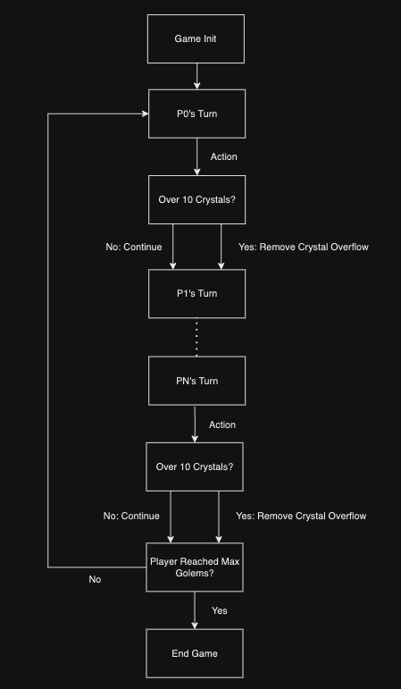

## Game State

I modeled the different game states `Golem` goes through in a finite state machine. This helped me tremendously with coding
the backend of the game as I used this model as a reference.

